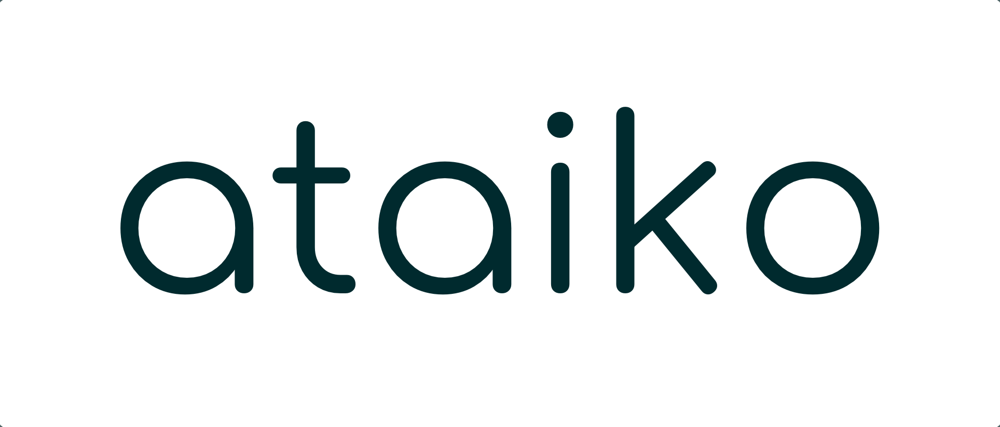

<p align="center">
  
</p>

---

__It is our mission to step-up life quality by connecting the ideal organisation to a talents true identity.__

We believe in the power of intrinsic motivation. People can become their best selves as soon as they focus on their strengths and see purpose in what they do. By enabling talents to spent their working time in a place they identify with, thus being their whole selfs, they tap into the potential of their own intrinsic motivation which automatically comes with true commitment, faster self-development and increased value creation.

---

# Autotag 

This repository contains the tool [autotag](https://github.com/pantheon-systems/autotag) baked into a docker image `ataiko/autotag`. 

## Getting Started

To use the image simply pull from `ataiko/autotag` and mount your folder. The binary `autotag` is omitted. 

```
docker run -v ${PWD}:/data -w /data ataiko/autotag -n
```

You will receive a report like this:
```
$ docker run -v ${PWD}:/data -w /data ataiko/autotag -n
0.2.2
```